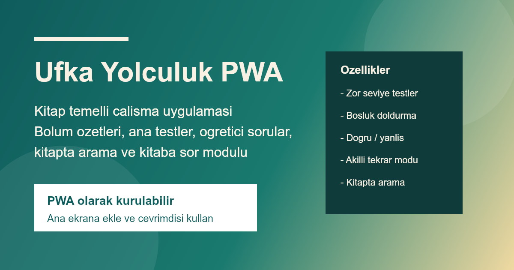

# Ufka Yolculuk PWA

Kitap temelli calisma uygulamasi. HTML, CSS ve JavaScript ile yazildi. Mobilde PWA olarak kurulabilir.

## Canli Yayin

- Uygulama: [https://halilibrahim1349.github.io/ufka-yolculuk-pwa/](https://halilibrahim1349.github.io/ufka-yolculuk-pwa/)
- Repo: [https://github.com/halilibrahim1349/ufka-yolculuk-pwa](https://github.com/halilibrahim1349/ufka-yolculuk-pwa)



## Ozellikler

- Bolum bazli ana testler
- Ayri ogretici kategori: bosluk doldurma ve dogru/yanlis
- Test sonunda toplu degerlendirme
- Bolum ozetleri
- Kitapta arama
- Kitaba sor
- PWA destegi

## Yerel Calistirma

```bash
npm install
npm start
```

Ardindan `http://localhost:4173` adresini acin.

## PWA Olarak Kullanma

- Siteyi HTTPS uzerinden acin.
- Chrome veya Edge'de `Ana ekrana ekle` secenegini kullanin.
- iPhone'da Safari ile `Paylas > Ana Ekrana Ekle` yolunu izleyin.

## Dagitim

Bu repo GitHub Pages uzerinden yayinlanacak sekilde hazirlandi.
